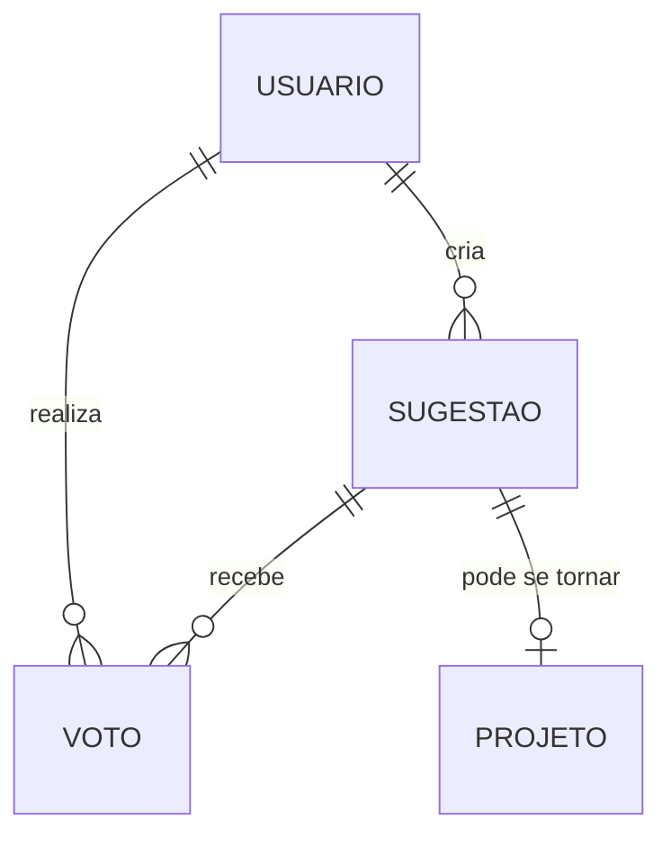

# 🏛️ VOTA-E API

API REST para gestão de sugestões e projetos comunitários municipais, facilitando a participação cidadã nas decisões da cidade.

## 📋 Sobre o Projeto

O VOTA-E é uma plataforma que permite aos cidadãos submeterem sugestões para melhorias em sua cidade. As sugestões com maior engajamento da comunidade são automaticamente convertidas em projetos que serão encaminhados à câmara dos vereadores para análise e possível implementação.

### Funcionalidades Principais

- Autenticação segura via JWT
- Gestão de usuários
- Criação e votação de sugestões
- Conversão automática de sugestões populares em projetos
- Integração com a câmara de vereadores
- (Futuro) Geolocalização para vincular usuários às suas cidades

## 🚀 Tecnologias Utilizadas

- Java 21
- Spring Boot 3.3.4
- Oracle Database
- Docker
- Flyway (Migrations)
- JWT (Autenticação)
- Azure Cloud

## 🔧 Pré-requisitos

- Java 21
- Docker e Docker Compose
- Maven
- Oracle Database (ou container Docker)
- Azure CLI (para deploy)

## 📦 Estrutura do Projeto

```
src/
├── main/
│   ├── java/
│   │   └── br/com/fiap/vota-e/
│   │       ├── advice/
│   │       ├── config.security/
│   │       ├── controller/
│   │       ├── dto/
│   │       ├── exception/
│   │       ├── model/
│   │       ├── repository/
│   │       └── service/
│   └── resources/
│       ├── db/migration/
│       └── application.properties
```

## 🛠️ Configuração e Instalação

1. Clone o repositório:
```bash
git clone https://github.com/pedroarthuralvesdeoliveira/vota-e-spring-boot-api
cd vota-e
```

2. Configure as variáveis de ambiente:
```bash
cp .env.example .env
# Edite o arquivo .env com suas configurações
```

3. Execute o Docker Compose:
```bash
docker-compose up -d
```

4. Execute as migrations:
```bash
mvn flyway:migrate
```

5. Execute a aplicação:
```bash
mvn spring-boot:run
```

## 🔐 Autenticação

A API utiliza JWT (JSON Web Tokens) para autenticação. Para obter um token:

```http
POST /auth/login
Content-Type: application/json

{
    "email": "usuario@exemplo.com",
    "password": "senha123"
}
```

## 📝 Endpoints Principais

### Usuários
- `POST /api/usuarios` - Criar usuário
- `GET /api/usuarios` - Listar usuários
- `GET /api/usuarios?email=` - Buscar usuário por e-mail
- `GET /api/usuarios?telefone=` - Buscar usuário por telefone
- `GET /api/usuarios/{id}` - Buscar usuário específico
- `PUT /api/usuarios/{id}` - Atualizar usuário
- `DELETE /api/usuarios/{id}` - Deletar usuário

### Sugestões
- `POST /api/sugestoes` - Criar sugestão
- `GET /api/sugestoes` - Listar sugestões
- `GET /api/sugestoes/{id}` - Buscar sugestão específica
- `PUT /api/sugestoes/{id}` - Atualizar sugestão
- `POST /api/sugestoes/{id}/vote` - Votar em uma sugestão

### Projetos
- `GET /api/projetos` - Listar projetos
- `GET /api/projetos/{id}` - Buscar projeto específico
- `PUT /api/projetos/{id}` - Atualizar status do projeto

## 🚀 Deploy

### Azure

1. Configure o Azure CLI:
```bash
az login
```

2. Crie os recursos necessários:
```bash
az group create --name votae-rg --location eastus
az acr create --name votaeregistry --resource-group votae-rg --sku Basic
```

3. Build e push da imagem Docker:
```bash
az acr build --registry votaeregistry --image votae-api:latest .
```

4. Deploy no Azure App Service:
```bash
az webapp create --resource-group votae-rg --plan votae-plan --name votae-api --deployment-container-image-name votaeregistry.azurecr.io/votae-api:latest
```

## 📊 Modelo de Dados



## 🤝 Contribuindo

1. Faça o fork do projeto
2. Crie sua branch de feature (`git checkout -b feature/AmazingFeature`)
3. Commit suas mudanças (`git commit -m 'Add some AmazingFeature'`)
4. Push para a branch (`git push origin feature/AmazingFeature`)
5. Abra um Pull Request

## 📝 Licença

Este projeto está sob a licença MIT. Veja o arquivo [LICENSE](LICENSE) para mais detalhes.

## 📞 Contato

Pedro Oliveira - [@pedroarthuralves](linkedin.com/in/pedroarthuralves) - dev@pedrooliveira.tech

Link do Projeto: [https://github.com/pedroarthuralvesdeoliveira/vota-e-spring-boot-api](https://github.com/pedroarthuralvesdeoliveira/vota-e-spring-boot-api)
